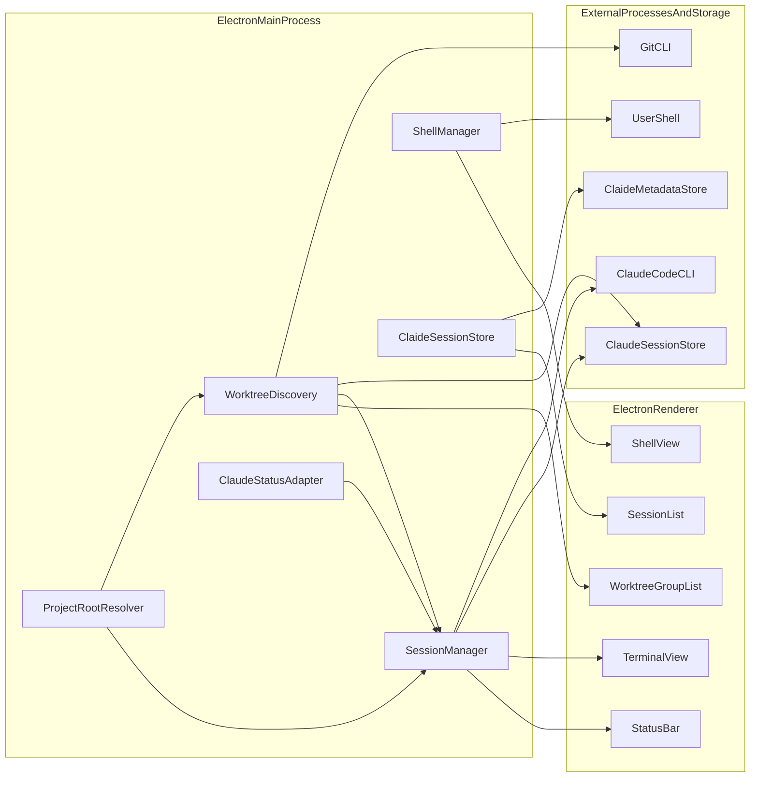

# Claide - Windows-First Claude Code Control Plane

**Date:** 2026-04-13
**Status:** Revised

## Overview

Claide is a lightweight Windows desktop app for supervising Claude Code sessions inside one active project root. It is inspired by Scape.work but intentionally narrower: PTY-faithful session management first, optional convenience features later.

Claide is not a full IDE, not a cloud orchestrator, and not a voice-first assistant. It is a local control plane around real terminals.

## Product Positioning

- Claide owns session lifecycle, terminal display, and project-root context.
- The user's editor remains the source of truth for code editing and review.
- Claude Code's own session store remains the source of truth for resumable sessions.
- Claide metadata stores presentation concerns only.

## Goals

- Launch, switch, stop, and resume multiple Claude Code sessions inside one opened project root.
- Preserve real terminal fidelity on Windows.
- Show stable session metadata without depending on fragile parser-only fields.
- Provide one separate shell terminal for user-driven commands.
- Stay local-only and fast enough to manage 5-8 sessions comfortably.

## Non-Goals

- Voice transcription or local ASR.
- File editing or Monaco-style editor surfaces.
- Embedded browser, PR viewer, watchdogs, or toolkit automation.
- Multi-project workspaces.
- Cross-platform parity before Windows PTY and path behavior are solid.
- Deep Claude orchestration features beyond session lifecycle.

## MVP Definition

MVP ships when Milestones 0 through 3 are complete. The first usable version must do all of the following end-to-end:

- Open one project root in Claide.
- Detect the git repo and discover all worktrees via `git worktree list --porcelain`.
- Show sessions grouped by worktree with expand/collapse and active-worktree emphasis.
- Fall back to a flat session list if the directory is not a git repo or git is unavailable.
- Create a new Claude session in any discovered worktree.
- Resume an existing Claude session that Claude Code can already restore.
- Switch between multiple active sessions across worktrees without losing scrollback.
- Stop a session and surface clear saved or error state.
- Persist display metadata (name, color, order, worktree collapse state) in `.claide/sessions.json` at the repo root.
- Show one separate shell terminal.
- Show degraded but correct UI when parser-derived fields are unavailable.

## Deferred From MVP

- Read-only file tree and file viewer.
- Session drag reordering.
- Rich telemetry like cost or context bars unless the parser proves stable.
- Settings beyond basic Claude CLI and shell path overrides.
- Worktree creation, deletion, or cleanup UI.
- Any Scape-style toolkit or watchdog features.

## Worktree Strategy

Claide v1 discovers and organizes existing worktrees but does not create or delete them.

### Design Principle

Users (or Claude Code via `--worktree`) create worktrees. Claide discovers all worktrees for a repo, groups sessions by worktree, and lets you launch or resume sessions in any of them. This gives 90% of the Scape worktree experience without owning worktree lifecycle in v1.

### Validated: Session Namespace Behavior

**Tested 2026-04-13 against Claude Code 2.1.104 on Windows.**

Claude Code uses the **literal cwd absolute path** as the session namespace. It does NOT normalize to the git repository root. Each worktree gets its own session directory:

- Main checkout at `C:\Users\Foo\repo` → sessions in `~/.claude/projects/C--Users-Foo-repo/`
- Worktree at `C:\Users\Foo\repo\.claude\worktrees\feat` → sessions in `~/.claude/projects/C--Users-Foo-repo--claude-worktrees-feat/`
- Worktree at `D:\worktrees\hotfix` → sessions in `~/.claude/projects/D--worktrees-hotfix/`

**Path encoding rules:** replace `\`, `/`, `:`, and `.` with `-`. Everything else is preserved.

### Discovery Algorithm

When the user opens any directory in Claide:

1. Detect whether it's a git repo: check for `.git` (file or directory).
2. If `.git` is a file, this is a linked worktree — read the `gitdir:` pointer to find the shared repo.
3. Run `git rev-parse --git-common-dir` to get the canonical shared `.git` path. This is the **repo identity**.
4. Run `git worktree list --porcelain` to enumerate all worktrees. Parse each record for: path, branch, HEAD sha, locked/prunable status.
5. For each worktree path, compute the Claude session namespace by applying the path encoding rules to the absolute path.
6. Scan `~/.claude/projects/<encoded-path>/` for `*.jsonl` files to find sessions.
7. Group result: repo → worktrees → sessions per worktree.

### Worktree Types

Both types appear in `git worktree list` output — no special handling needed:

- **Claude-created**: `<repo>/.claude/worktrees/<name>/`, branch `worktree-<name>`
- **User-created**: anywhere on disk, any branch name

### UI Grouping Model

The session list becomes a tree grouped by worktree:

```
▼ main (develop)                              ← main checkout
    "refactor auth"    [running]
    "fix tests"        [saved]
▼ .claude/worktrees/feature-auth (worktree-feature-auth)
    "implement oauth"  [running]
▼ D:\worktrees\hotfix (hotfix/v2.1)           ← user-created elsewhere
    (no sessions)
```

- The worktree the user opened Claide from gets visual emphasis as the "active" worktree.
- Collapsed/expanded state persists in Claide metadata.
- Prunable worktrees show a warning indicator.
- Clicking a worktree header expands or collapses its session list.
- Sessions within each worktree work exactly like the single-root model: create, resume, switch, stop.

### Non-Directory Roots

If the opened directory is not a git repo, Claide falls back to single-root mode: one flat session list, no worktree grouping. This keeps the app usable for non-git projects.

### Future: Worktree Creation (v2+)

After the discovery model is proven stable, a future version could add:

- "New Worktree" button that runs `git worktree add`
- Branch name input with convention suggestions
- Cleanup UI for merged/prunable worktrees (with NTFS junction safety checks)
- Integration with Claude Code's `.worktreeinclude` for copying gitignored files

## Milestones

### Milestone 0: Integration proof

Goal: prove the risky external contracts before building UI around them.

Deliverables:

- One manual Electron test harness that spawns Claude Code via PTY.
- Transcript capture for spawn, resume, output parsing, stop, and resize.
- Worktree discovery proof: run `git worktree list --porcelain` from a linked worktree, parse output, compute session namespaces, verify session JSONL files are found.
- Written notes on validated CLI commands, storage layout, parser stability, and worktree namespace behavior.

### Milestone 1: Single-session core

Goal: make one Claude session reliable in one root directory.

Deliverables:

- Open project root.
- Spawn one Claude PTY.
- Stream terminal output to xterm.js.
- Forward keyboard input and resize.
- Detect basic running, stopped, and error state.
- Handle missing Claude CLI with a clear error.

### Milestone 2: Multi-session lifecycle

Goal: turn the single-session proof into a real control plane.

Deliverables:

- Create multiple sessions.
- Switch visible terminal without re-attaching PTY state.
- Resume saved Claude sessions.
- Persist Claide display metadata.
- Show stable list state: running, saved, error, and last active.

### Milestone 3: Worktree discovery and shell

Goal: make Claide worktree-aware and add a user shell.

Deliverables:

- On project open, detect git repo and enumerate all worktrees via `git worktree list --porcelain`.
- Compute session namespaces for each worktree path and discover sessions across all of them.
- Group session list by worktree with expand/collapse and active-worktree emphasis.
- Show worktree branch, path, and status (prunable/locked) in the group header.
- Fall back to flat session list for non-git directories.
- Separate shell PTY (PowerShell default).
- Minimal header and status bar.
- Optional CLI path override for Claude and shell executables.

### Milestone 4: Nice-to-have read-only context

Goal: add convenience without changing the app's role.

Deliverables:

- Read-only file tree.
- Basic file preview.
- Gitignore-aware filtering.

This milestone should only start if Milestones 0-3 are stable.

## Assumptions And Validation Spikes

### Spike 1: Claude CLI contract on Windows

Validate against a real Claude Code install:

- Exact command for starting a named session: `claude --name <name>` or `claude -n <name>`.
- Exact command for resuming a saved session: `claude --resume <id-or-name>` or `claude --continue`.
- Exit codes and terminal behavior on normal exit, interrupted exit, and failed spawn.
- Whether named sessions are stable enough to display but not rely on as primary identity.
- Behavior of `--session-id <uuid>` and `--fork-session` flags.

### Spike 2: Claude session storage layout — PARTIALLY VALIDATED

**Validated 2026-04-13:**

- Sessions stored at `~/.claude/projects/<path-encoded-cwd>/<uuid>.jsonl`.
- Path encoding replaces `\`, `/`, `:`, `.` with `-`. Everything else preserved.
- Session index at `~/.claude/sessions/<pid>.json` with fields: pid, sessionId, cwd, startedAt, kind, entrypoint.
- **Each worktree gets its own namespace** — Claude uses literal cwd, not git repo root.
- Desktop app tracks worktrees separately in `%APPDATA%\Claude\git-worktrees.json`.

**Additionally validated 2026-04-13:**

- The JSONL filename UUID matches the `sessionId` field inside every JSONL record and the `sessionId` in the PID index file. The UUID is the stable canonical session key.
- `claude --resume <uuid>` accepts the JSONL filename UUID directly.

**Still needs validation:**

- Whether moving or renaming a project folder breaks resume.
- Cleanup behavior: files older than 30 days auto-deleted on startup (configurable via `cleanupPeriodDays`).

### Spike 3: Status parsing fidelity

Validate using recorded terminal transcripts:

- Whether model name can be parsed reliably.
- Whether "thinking", "generating", and idle states are distinguishable from ordinary output.
- Whether cost and context fields appear consistently enough to surface in UI.
- What degraded mode looks like when parsing fails.

### Spike 4: Windows PTY behavior

Validate:

- `node-pty` plus ConPTY with multiple Claude sessions.
- Resize behavior.
- Unicode and ANSI handling.
- Termination behavior on Windows when a child ignores soft shutdown.
- Startup behavior across PowerShell 7, Windows PowerShell, and optional Git Bash.

### Spike 5: Git worktree discovery on Windows

**Partially validated 2026-04-13.**

Confirmed:

- `git worktree list --porcelain` works from any worktree and returns all worktrees for the repo.
- Output uses forward-slash paths on Windows (`C:/Users/...`).
- `git rev-parse --git-common-dir` returns the shared `.git` from any worktree.
- `.git` is a file in linked worktrees (contains `gitdir:` pointer) vs a directory in the main checkout.
- Prunable worktrees are flagged in porcelain output.
- Git refuses to delete branches checked out in worktrees even with `-D`.

Still needs validation during Milestone 0:

- Performance of worktree list + session namespace scan across repos with 10+ worktrees.
- Behavior with worktrees on different drives or network paths.
- Edge cases: worktrees inside cloud-synced folders (OneDrive, Dropbox).
- NTFS junction traversal risk when future cleanup features are added.

## Core Runtime Architecture

### Tech Stack

- Electron
- React
- Vite or electron-vite
- node-pty
- xterm.js
- simple-git or child_process for `git worktree list --porcelain` and `git rev-parse`
- chokidar, only if the file-tree milestone ships
- ignore, only if the file-tree milestone ships

### Ownership Model

- The main process owns PTYs, filesystem access, worktree discovery, session discovery, and metadata persistence.
- The renderer owns layout, user interaction, and xterm instances.
- Claude Code owns resumable session storage.
- Claide owns presentation metadata only.

### Runtime Diagram



### IPC Contract

Keep IPC narrow and typed. The main process is the single source of truth for all session and worktree state. The renderer never queries Claude storage or git directly.

**Data flow rule:** `project:open` triggers full discovery (worktrees + sessions + metadata merge). The result is one canonical payload sent to the renderer via `project:state`. All other IPC either mutates state (and returns updated state) or streams terminal data.

Channels for Milestones 1-3:

- `project:open` — renderer requests opening a directory. Main process runs full discovery and reconciliation.
- `project:state` — main → renderer. Single canonical payload: `{ worktrees: [{ path, branch, status, sessions: [{ uuid, displayName, color, lifecycle, ... }] }] }`. This is the only source of truth for the session list UI.
- `session:create` — create a new Claude session in a specified worktree path. Returns updated `project:state`.
- `session:resume` — resume a saved session by UUID. Main process resolves the UUID to its discovered worktree path and spawns `claude --resume <uuid>` with that worktree path as the PTY cwd. Returns updated `project:state`.
- `session:stop` — stop a running session. Returns updated `project:state`.
- `session:rename` — update display name in Claide metadata. Returns updated `project:state`.
- `session:input` — forward keyboard input to a session's PTY.
- `session:resize` — forward resize to a session's PTY.
- `session:data` — main → renderer. Terminal output stream for a specific session.
- `session:lifecycle` — main → renderer. State change events (running, stopped, error).
- `shell:create` — spawn the user shell PTY.
- `shell:input` — forward keyboard input to the shell PTY.
- `shell:resize` — forward resize to the shell PTY.
- `shell:data` — main → renderer. Terminal output stream for the shell.

Only add file-tree IPC if Milestone 4 starts.

## Session Model And Persistence

### Canonical Session Identity

**Validated 2026-04-13.** The JSONL filename UUID is the stable canonical session ID. It matches:

- The `sessionId` field inside every JSONL record.
- The `sessionId` field in `~/.claude/sessions/<pid>.json`.
- The ID accepted by `claude --resume <uuid>`.

Claide uses this UUID as the primary key for all session operations: resume, rename, merge, and orphan cleanup.

### Canonical Ownership

- Claude session storage (`~/.claude/projects/<namespace>/<uuid>.jsonl`) is canonical for resumable session identity and history.
- Claide metadata (`.claide/sessions.json`) stores presentation concerns only.

### Metadata File Location

`.claide/sessions.json` lives at the **main checkout working tree**, not inside individual worktrees.

**How to find the main checkout path:** `git rev-parse --git-common-dir` returns the shared `.git` directory (e.g., `C:/Users/Foo/repo/.git`), not the working tree. To get the main checkout: take the first `worktree` entry from `git worktree list --porcelain` — git always lists the main checkout first. Alternatively, if `--git-common-dir` ends with `/.git`, its parent is the main checkout.

Rationale:

- There is exactly one main checkout per git repository, always the first entry in `git worktree list`.
- Worktree collapse/expand state, session display names, and ordering are all repo-scoped concerns.
- If the metadata file lived per-worktree, opening the main checkout versus a linked worktree would show different display names for the same sessions.
- If the opened directory is not a git repo, `.claide/sessions.json` lives in the opened directory itself (single-root fallback).

### Metadata File Schema

```json
{
  "version": 1,
  "sessions": {
    "<uuid>": {
      "displayName": "refactor auth",
      "color": "#4a9eff",
      "order": 0,
      "lastActiveAt": "2026-04-13T14:30:00Z"
    }
  },
  "worktrees": {
    "<encoded-worktree-path>": {
      "collapsed": false
    }
  }
}
```

Sessions are keyed by Claude session UUID. Worktree UI state is keyed by the encoded worktree path (same encoding Claude uses for namespaces). This keeps the file flat and avoids nesting sessions under worktrees — a session's worktree membership is derived from which namespace directory it lives in, not from this metadata file.

### Reconciliation Rules

On startup:

1. Resolve the opened directory to a canonical Windows path (normalize separators, drive-letter casing, resolve symlinks).
2. Determine the main checkout: parse the first `worktree` entry from `git worktree list --porcelain` (git always lists the main checkout first). If not a git repo, use the opened directory as the sole root.
3. Enumerate all worktrees via `git worktree list --porcelain`. If not a git repo, treat the opened directory as the only "worktree."
4. For each worktree, compute the Claude session namespace by applying path encoding (replace `\`, `/`, `:`, `.` with `-`) to the worktree's absolute path.
5. Scan `~/.claude/projects/<namespace>/` for `*.jsonl` files. Each filename (minus `.jsonl`) is a session UUID.
6. Read `.claide/sessions.json` from the main checkout path (or opened directory for non-git).
7. For each discovered session UUID, apply matching Claide display metadata if present.
8. Keep orphaned Claide entries (UUIDs with no matching JSONL) as stale metadata. Surface them dimmed in the UI until the user clears them.
9. Group sessions by worktree for the renderer.

### Canonical Path Rules

Normalize all paths before using them in storage or comparison:

- Resolve relative paths to absolute paths.
- Use `fs.realpath` when available.
- Normalize separators to the platform convention.
- Normalize drive-letter casing to uppercase consistently.
- Treat each worktree path as a distinct Claude session namespace.
- Compare paths case-insensitively on Windows (NTFS).
- Validate junctions, symlinks, long-path prefixes, and cloud-synced folders during Milestone 0 before caching canonical roots.

## Windows Runtime Notes

### PTY Backend

- Assume ConPTY-backed behavior through `node-pty` on supported Windows builds.
- Do not document Unix-only signals like `SIGTERM` as the primary shutdown mechanism.
- Use a staged shutdown model: request stop, wait briefly, then force-kill if needed.

### Shell Support

Default shell order:

1. PowerShell 7 (`pwsh`)
2. Windows PowerShell (`powershell.exe`)
3. User-specified custom shell path

Git Bash or WSL should be opt-in, not assumed.

### Process Lifecycle

For every session and shell:

- Record spawn command, cwd, and start time.
- Surface exit code and explicit stopped or error states.
- Separate user-requested stop from crash or failed spawn.
- Treat resize and reconnect as first-class PTY events, not UI details.

### Parser Strategy

The status parser must be treated as an adapter, not a source of truth.

- Test it against saved transcripts.
- Strip ANSI noise before matching.
- Allow unknown state without breaking the session list.
- Show parser-derived fields only when confidence is high.

## UI Surface

### MVP Layout

MVP only needs three surfaces:

- Session list
- Active Claude terminal
- Optional shell panel

A file tree is explicitly post-MVP.

### Session Card Fields

Must-have:

- Display name
- Root label or branch if cheap to compute
- Lifecycle state: running, saved, stopped, or error
- Last active time

Best-effort:

- Model
- Cost
- Context usage
- Thinking or generating substate

If best-effort fields are missing, the card must remain usable.

### Interaction Model

- Click a running session to focus it.
- Click a saved session to resume it.
- Rename only Claide display metadata.
- Stop a session from contextual actions.
- Keep keyboard shortcuts minimal until MVP is stable.

## Error Handling

| Scenario | Behavior |
|----------|----------|
| Claude CLI not found | Block session creation and show installation or configuration help. |
| Claude spawn fails | Mark session as error with a retry action. |
| Resume target missing | Show the saved session as unavailable and offer a start-fresh path. |
| Parser fails | Drop parser-derived fields but keep the terminal usable. |
| Root path missing | Prompt the user to re-open a root. |
| Shell spawn fails | Keep Claude sessions usable and show a shell-specific error. |
| PTY disconnects unexpectedly | Mark the session as error and preserve scrollback if possible. |
| Git not found | Disable worktree discovery and fall back to flat session list. Show a non-blocking warning. |
| Worktree directory missing | Mark worktree as prunable in the group header. Sessions still shown as saved. |
| Worktree list fails | Fall back to single-root mode for the opened directory only. |

## Future Enhancements

- Worktree creation and cleanup UI
- Read-only file tree and preview
- Rich telemetry once parser stability is proven
- Session reorder and layout persistence
- Toolkit actions
- Watchdogs or orchestrators
- Embedded browser or PR inspector
- Voice transcription

## Appendix A: Visual Direction

- Dark, low-distraction UI inspired by Scape
- Terminal-first center of gravity
- Windows-native shortcut language and wording
- Avoid pixel-perfect theming work until Milestones 0-3 are validated

## Appendix B: Target Project Structure

```text
claide/
|-- package.json
|-- electron-builder.yml
|-- CLAUDE.md
|-- src/
|   |-- main/
|   |   |-- index.ts
|   |   |-- project-root.ts
|   |   |-- session-manager.ts
|   |   |-- shell-manager.ts
|   |   |-- worktree-discovery.ts
|   |   |-- claude-store.ts
|   |   |-- claide-store.ts
|   |   |-- status-adapter.ts
|   |   `-- ipc-handlers.ts
|   |-- renderer/
|   |   |-- App.tsx
|   |   |-- components/
|   |   |   |-- WorktreeGroup.tsx
|   |   |   |-- SessionList.tsx
|   |   |   |-- SessionCard.tsx
|   |   |   |-- TerminalPanel.tsx
|   |   |   `-- ShellPanel.tsx
|   |   `-- styles/
|   `-- shared/
|       `-- types.ts
`-- documentation/
    `-- plan/
        `-- 2026-04-13-claide-design.md
```

## Appendix C: Initial Shortcuts

Only ship the minimum set at first:

- `Ctrl+N` new session (in the active worktree)
- `Ctrl+1` through `Ctrl+8` focus session by flat visual index
- `Ctrl+Tab` next session
- `Ctrl+Shift+Tab` previous session
- `Ctrl+\`` toggle shell

**Ordering rule for `Ctrl+1` through `Ctrl+8`:** Sessions are indexed by their **flat visual order** in the session list, top to bottom, skipping collapsed worktree group headers. Index 1 is the topmost visible session regardless of which worktree it belongs to. If a worktree group is collapsed, its sessions are not indexed. This matches how browser tab shortcuts work — positional, not semantic.

This list should grow only after the session core is stable.
